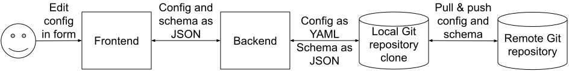

# yaml-ui-editor

YAML UI editing demo application with Git repository storage.

## Overview

The purpose of this sample application is to demonstrate how to generate web
user interfaces for editing externalized application configuration files in
YAML format.

Examples of such files include
[Spring Boot external configuration](https://docs.spring.io/spring-boot/docs/current/reference/htmlsingle/#features.external-config)
files (`application.yml` and similar), and
[custom configuration for Ruby on Rails](https://guides.rubyonrails.org/configuring.html#custom-configuration)
applications (via `Rails::Application.config_for`).

## Motivation

Most applications have some externalized configuration. This configuration
can be either technical, e.g., URLs for integration points, or they can be
related to business rules that are evaluated by the application, such as
limits, ranges, permitted values, etc.

The business-related configuration values are sometimes maintained and edited
by people who may not be familiar with version control, or structured
configuration file formats such as JSON, YAML, and properties files.

Some organizations handle this by adding a database in the runtime environment
that is used for this configuration, and updates to the values are sometimes
made directly to the production environment database. These updates are often
validated by a process that is different from - and often less rigorous than -
the typical production release process for an application. This can be a
potential source of instability.

An alternative to the runtime configuration database is to apply the principle
of
[hermetic releases](https://sre.google/sre-book/release-engineering/#continuous-build-and-deployment-Yms8u8),
where binaries are released alongside the configuration files. One way to
achieve this is to package configuration files into
["configuration packages"](https://sre.google/sre-book/release-engineering/#configuration-management-vJsYUr)
that are deployed alongside the binary.

An example of a configuration package mechanism is a Kubernetes
[ConfigMap](https://kubernetes.io/docs/concepts/configuration/configmap/).
Configuration files can be packaged into a ConfigMap, and the ConfigMap is
[referenced from the Kubernetes Pod specification](https://kubernetes.io/docs/concepts/configuration/configmap/#using-configmaps-as-files-from-a-pod).

To enable organizations to apply the same process for application changes as
for configuration changes, the configuration files can be stored in version
control alongside the application code.

Editing the configuration files can be facilitated by friendly user interfaces
that can hide the configuration file structure and version control mechanisms
from users who are unfamiliar with these.

This repository contains a sample application that shows how to build such an
interface. It uses the example of YAML configuration files, with Git as the
version control system.

## Running the application

Edit the file
[`src/main/resources/config/app.yml`](src/main/resources/config/app.yml)
to specify the URL of the Git repository that holds the config files and
schemas in the field `git.repository.url`.

You can also configure other properties in the same file, to customize the
behavior of the application. For instance, you can specify which branch to
check out from the Git repository, directories that contain the config files
and schemas, the local directory to use for the repository clone, and more.

Run the application:

```shell
./gradlew bootRun
```

The application will be available on
[http://localhost:8080](http://localhost:8080).

## Using the application

You can log in as one of the test users pre-configured in the class
[`WebSecurityConfig`](src/main/java/com/google/example/yamlui/security/WebSecurityConfig.java),
e.g. `alice`, `bob`, or `charlie`. All users have the same password:
`password`.

The available configs are shown on the horizontal top menu.

Try making a change to one of the configs, click *Save*, and then go to the
Git repository to see the commit that was made by the application on behalf of
the user.

## Design

The application operates on two types of resources: config files and schemas.
Config files are YAML files containing external application configuration.
Schemas are [JSON Schemas](https://json-schema.org/) that define the structure
of the config files. Each config file has a corresponding JSON schema.

The JSON schemas are used to generate web forms for viewing and editing
values, and for validating the user-supplied data, both in-browser and on the
server-side.

To allow JSON schemas to operate on the config, the config files are converted
from YAML to JSON on the server-side, before they are sent to the browser
client. This enables the application to use standard JSON Schema-based web
user interface libraries to automatically generate the web forms.



When a user clicks *Save*, the browser client sends the form contents as JSON
to the back-end. The server validates the input according to the JSON Schema,
then converts the JSON to YAML, saves the YAML config to a file, and then
commits and pushes that file to the Git repository.

## Conflict resolution

This application deals with two Git repositories for config files and their schemas: the remote Git
repository, and the local clone.

The remote Git repository is the primary repository, and it is likely hosted on a centralized Git
host. If developers or operations staff have direct access to this repository, they could commit
changes  that conflict with edits made by users of this application.

Local repository conflicts can arise when two users of the application simultaneously make changes
to the same config file.

This application employs different conflict resolution mechanisms for the two scenarios.

### Local repository conflicts

When the UI requests a config file from the local Git repository for displaying a form, the
response to the browser includes the latest Git commit ID for that file in the
[`ETag` HTTP header](https://developer.mozilla.org/en-US/docs/Web/HTTP/Headers/ETag).

When the user - let's call them "user A" - submits the form, the request includes the same commit
ID in the `ETag` HTTP request  header. The application compares the commit ID in the request with
the latest commit ID for that config file from the local Git repository. If another user -
"user B" - submits a change to the same config file in between user A loading the form and
submitting, the latest commit ID for that config file in the local Git repository will have
changed. The change submitted by user A will not be saved, and user A will see an error message
informing them that their submission failed due to concurrent changes.

This is implemented in the `loadConfig()` and `saveConfig()` methods in the files
[`src/main/java/com/google/example/yamlui/config/ConfigController.java`](src/main/java/com/google/example/yamlui/config/ConfigController.java)
and
[`src/main/java/com/google/example/yamlui/config/ConfigRepository.java`](src/main/java/com/google/example/yamlui/config/ConfigRepository.java),
and in the JavaScript form submission event listener in the file
[`src/main/resources/static/index.js`](src/main/resources/static/index.js).

### Remote repository conflicts

For simultaneous edits in the remote Git repository, the application uses standard
[Git merge strategies](https://git-scm.com/docs/merge-strategies).
This is implemented in the `pull()` method in the file
[`src/main/java/com/google/example/yamlui/git/GitClient.java`](src/main/java/com/google/example/yamlui/git/GitClient.java).

The implementation uses the
[`recursive`](https://git-scm.com/docs/merge-strategies#Documentation/merge-strategies.txt-recursive)
merge strategy with the `conflict` option. Specifically, it performs the equivalent of:

```shell
git pull --ff --no-rebase --strategy recursive --strategy-option conflict [remote] [branch]
```

If the pull command results in conflicts, the application discards the submitted change and brings
the its local Git clone in line with the remote Git repository. The implementation performs the
equivalent of

```shell
git reset --hard remotes/origin/main
```

The intent of using this approach is to allow clean merges where non-conflicting edits are made to
the same file, and to discard local changes if a commit has a conflict. The application then
reloads the form with the latest values from the remote Git repository, and the user can attempt to
make their changes again, if they still wish to do so.

## Key dependencies

[`JSON Editor`](https://github.com/json-editor/json-editor) for the web user
interface form generation from JSON Schemas. MIT license.

[JGit](https://www.eclipse.org/jgit/) for the Java implementation of Git.
[Eclipse Distribution License - v 1.0](https://www.eclipse.org/org/documents/edl-v10.php),
an Open Source Initiative (OSI) Approved Open Source License by means of the
[3-clause BSD License](https://opensource.org/licenses/BSD-3-Clause).

[Spring Boot](https://spring.io/projects/spring-boot) for the server-side
implementation application framework. Apache 2.0 license.

[Spring Security](https://spring.io/projects/spring-security) for the
authentication and authorization. Apache 2.0 license.

[`networknt/json-schema-validator`](https://github.com/networknt/json-schema-validator)
for server-side validation of config using JSON Schema. Apache 2.0 license.

[Jackson](https://github.com/FasterXML/jackson) for converting between
JSON and YAML. Apache 2.0 license.
This application uses Jackson instead of
[Gson](https://github.com/google/gson) because Jackson is already a
dependency of `networknt/json-schema-validator`.

## Alternative JSON Schema implementations

Numerous
[implementations of JSON Schema](https://json-schema.org/implementations.html)
exist for a range of languages.

These implementations support various features, such as Web UI generation,
validation, code generation, and more.

For Web UI generation, there are a number of
[implementations](https://json-schema.org/implementations.html#web-ui-generation).

## Disclaimer

This is not an officially supported Google product.
